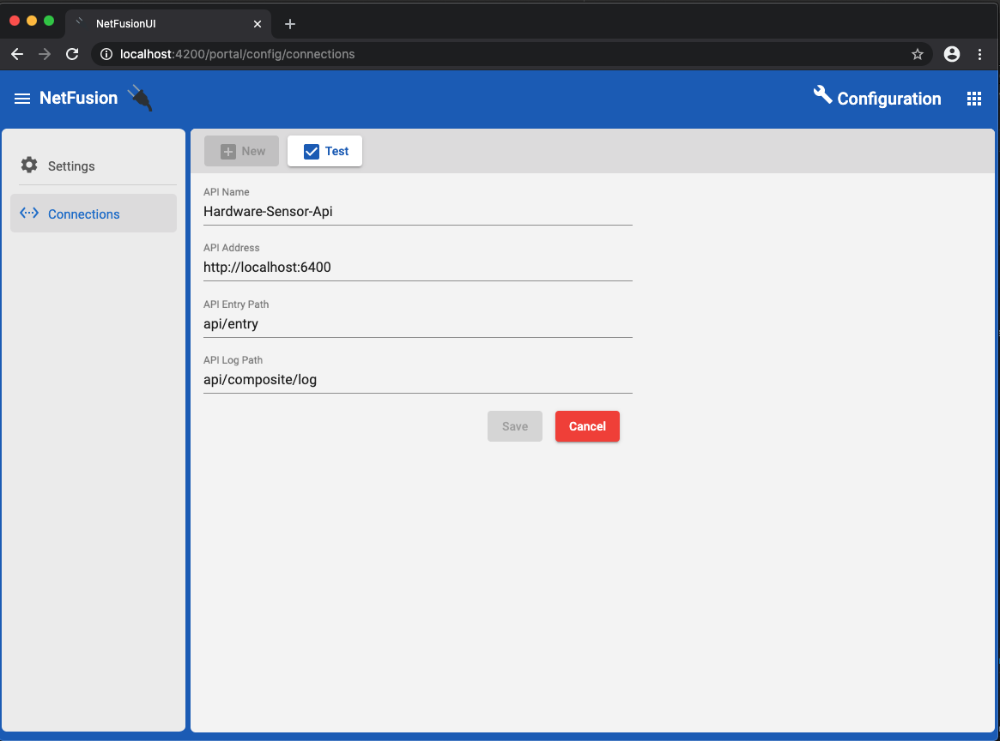

# NetFusion UI

*Inspect, interact, and watch - your microservice*

## Overview

The NetFusion UI allows developers to inspect, interact, and watch microservices based on the [NetFusion](https://github.com/grecosoft/NetFusion/wiki) class library used to build composite services.  After creating a microservice, a connection can be added to view the details of plugins from which the service is composed.  In addition, the developer can interface with their microservice:

* If the microservice utilizes the NetFusion.Rest.Service NugGet package, developers can easily invoke API methods and interact with resources and links.     
* If the base in-process messaging pipeline, or any of the NuGet packages extending it are used, developers can watch correlated messages being published and received in realtime.  

## Connections

The connections screen allows the developer to store connections to specific microservices.  Once a connection is configured, it is available from other screens.  All connections can be tested by selecting the **Test** button from the toolbar.  In addition, a specific connection can be edited, deleted, or copied.  If a connection is copied, the entry screen is displayed with entries initialized with the copied connection's values.

A connection has the following attributes:

* **Name**:  The readable name used to identify the API.

* **Address**:  The base address of the API.

* **Entry Path**:  Specifies the URL of the entry resource if the REST/HAL plugin NuGets are being used.  This URL is called to list the entry resources used to begin communication with the API.

* **Log Path**:  Indicates the URL used to obtain the composite log of the microservice.  The composite log displays details about all plugins from which the microservice is composed.

  

## Composite Log

  As mentioned above, the composite log is used to view the plugins from which a microservice is composed.  For each of the corresponding categories of plugins, there is a corresponding tab.  The following is displayed for a given plugin:

  * **Plugin Metadata:**  Displays metadata describing the plugin.
  * **Plugin Modules:**  If a plugin defines one or more modules, they are listed and can be selected.  When a module is selected, the plugin specific details recorded by the module are displayed.
  * **Registered Services:**  List any services that have been registered with the dependency-injection container by the plugin.

### Host Plugin

Display the composite log details for the Host plugin.  This corresponds to the running Web API based microservice.

### Application Plugins

A microservice consists of one or more application plugins.  These correspond to the assemblies containing application specific logic usually consisting of the following:

* **Domain:**  Assembly containing domain entities, commands, domain events, and queries based on the business process being implemented.
* **Application:**  Assembly containing Command, Domain Event, and Query handlers.  Services containing business logic spanning multiple domain-entities are also placed here.
* Infrastructure:**  Assembly containing technology dependent implementations.  Common examples are repositories and adapters.

### Core Plugins

Core plugins contain common cross-cutting implementations that can be shared across multiple microservices.  Most core plugins wrap open-source libraries and make them easier to use by completing configurations when the microservice bootstraps.  Also shown below are host a given plugin can add very detailed logs about how it configured the microservice.

### Realtime Correlated Message Log

The message log shows messages passing between publishes and subscribers and automatically displays details about the message.  Based on the messaging technology being used, additional details are logged.  For example, if message are being delivered out of process by RabbitMQ, the details of the exchanges and queues are logged.  Below shows an in-process messages, a RabbitMQ message, and a messaging being passed using Redis.

## Themes

## HAL Viewer

### Entry Resources

### Root Resource

### Embedded Resource

### Embedded Resource Collections

### Deleting Resources

